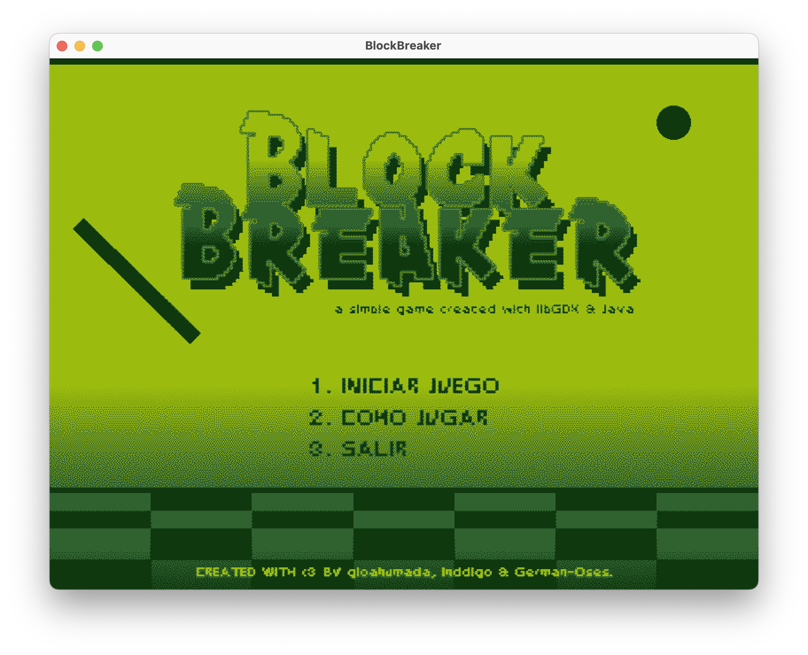

# BlockBreaker ⚾️



BlockBreaker es un juego de arcade inspirado en el clásico Breakout, desarrollado con LWJGL 3 (Lightweight Java Game Library). El objetivo es destruir todos los bloques usando una pelota que rebota en una paleta controlada por el jugador.

## 🎮 Características

- Gráficos 2D fluidos
- Sistema de puntuación
- Múltiples niveles
- Efectos de sonido
- Controles intuitivos con el teclado

## 🛠️ Requisitos del Sistema

- Java 17 o superior
- Gradle 7.x
- Sistema operativo compatible con LWJGL 3 (Windows, Linux, macOS)

## 🚀 Instalación y Ejecución

1. Clona el repositorio:

```bash
git clone https://github.com/tu-usuario/BlockBreaker.git
```
2. Navega al directorio del proyecto:
```bash
cd BlockBreaker
```
3. Compila y ejecuta el proyecto con Gradle:
```bash
./gradlew run
```

## 🎯 Controles

- `←` `→`: Mover la paleta
- `ESPACIO`: Lanzar la pelota
- `ESC`: Pausar el juego

## 👥 Equipo de Desarrollo

- German Oses
- Joshua Villavicencio
- Giovanni Ahumada

## 📝 Licencia

Este proyecto está bajo la Licencia MIT.

